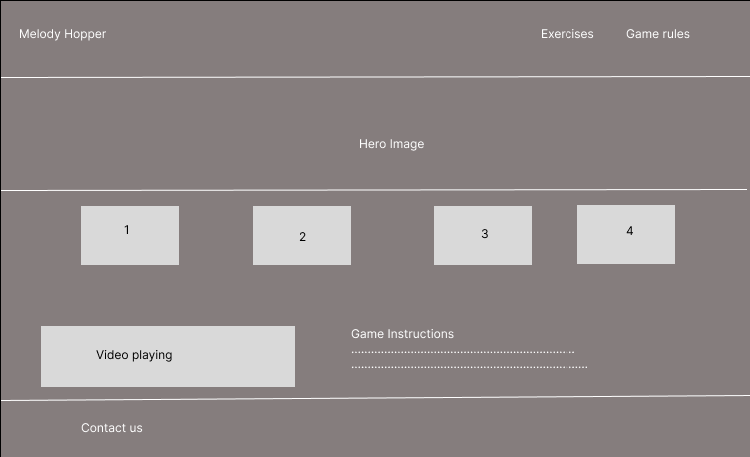
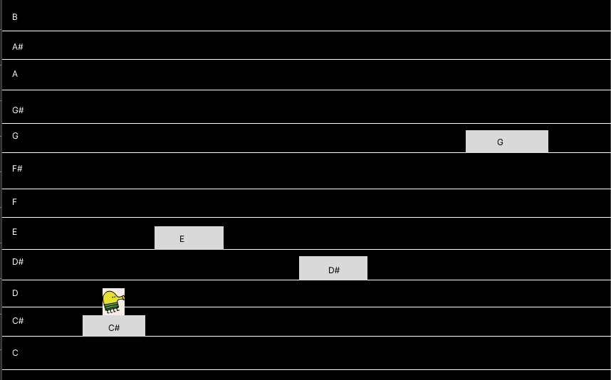

# Project Title
Melody Hopper

## Overview

Melody Hopper is an engaging and interactive game designed to help beginners, especially children, develop perfect pitch and improve their sight-reading skills in music. In this fun-filled game, players control a playful monster that jumps from tile to tile based on the musical notes sung aloud.

### Problem

Melody Hopper aims to address the challenge of learning sight-reading in music by providing an engaging and interactive platform. Many aspiring musicians struggle with identifying and accurately singing musical notes, which can hinder their progress. By combining gameplay with music education, Melody Jump helps users develop their pitch recognition and sight-reading skills in a fun, motivating environment. Players will enhance their musical literacy while enjoying the excitement of a game, making learning more accessible and enjoyable.

### Project setup

1. Git clone both client and server repositories Melody-Hopper and Melody-Hopper-API.
2. Make sure you have installed the libraries mentioned in the tech stack section below.
3. Create a file named .env and add your environment variables for both client and server. envsample is provided.
4. Run the client and server.
5. Follow the instructions in the graphical interface to play the game.

### User Profile

- Musicians:
    - Music enthusiasts who enjoy singing and want to improve their pitch recognition skills 
       while having fun.
    - Music instructors who want to incorporate a fun, interactive tool into their lessons.

### Features

- As a user, I want to be able to sing or hum notes displayed on the screen to improve my pitch recognition skills.
- As a user, I want to be able to receive instant feedback on my accuracy when singing notes to track my progress.
- As a user, I want to be able to choose different exercises to practice.
- As a user, I want the option to listen to the notes whenever I'm unsure.

## Implementation

### Tech Stack

- React
- MySQL
- Express
- Client libraries: 
    - react
    - react-router
    - axios
    - pitchfinder
    - sass
    - gsap (animation library)
    - react-scroll
    - fortawesome/react-fontawesome
    - fortawesome/free-brands-svg-icons
- Server libraries:
    - knex
    - express
    - cors
    - dotenv
    - mysql2

### APIs

- Audio Recognition API - Web Audio API
- Access Microphone - Media Devices API

### Sitemap

- Home page
- Game page

### Mockups
Home page:



Game page:



### Endpoints

**GET /cafes**

- Get exercises list

Parameters:
- none


Response:
```
[
    {
        "id": 1,
        "exercise_name": "Ascending Scale",
        "notes": "C D E F G A B C"
    },
    {
        "id": 2,
        "exercise_name": "Descending Scale",
        "notes": "C B A G F E D C"
    },
    ...
]
```

**GET /exercises/:id**

- Get exercise by id

Parameters:
- id: exercise id as number

Response:
```
{
    "id": 2,
    "exercise_name": "Descending Scale",
    "notes": "C B A G F E D C"
}
```

## Roadmap

- Create client
    - react project with routes and boilerplate pages

- Create server
    - express project with routing, with placeholder 200 responses

- Create migrations

- Gather 10 sample input strings of musical notes (e.g., ["C", "D", "E", "F", "G", "A", "B", "C#", "D#", "F#"])

- Create seeds with sample exercise data

- Deploy client and server projects so all commits will be reflected in production

- Feature: Home page
    - Implement list cafés page including location form
    - Store given location in sessionStorage
    - Create GET /cafes endpoint

- Feature: Game Page
    - Colored Tiles: The tiles on the wall are color-coded according to the string of musical notes for each exercise.

    - Side Panel with Musical Notes: There is a side panel displaying all 12 musical notes. Each note is represented by a visually distinct tile and a clear label indicating the note name (e.g., C, D, E, etc.). Clicking on a note plays the corresponding audio reference, aiding users in learning the correct pitches.

    - Singing Interaction: The monster jumps to the corresponding tile if the note is sung correctly. If a user sings an incorrect note, The corresponding tile will blink, indicating the mistake.

    - End of Exercise: Once all notes are sung correctly, two options are presented, "Return to the home page" and "Play the exercise again" ensuring a smooth transition back to the home page or a reset of the game state for replaying.

- Bug fixes

- DEMO DAY

## Nice-to-haves

- Ensure Responsive Design: Optimize the website for various screen sizes and devices.
- Utilize Session Storage: Implement session storage to save user progress and track completed exercises.
- Broaden Note Range: Expand the range of input musical notes beyond the current middle octave to encompass any octave.
- Enhance Animations: Introduce additional animations to make the game more engaging and interactive.
- Instructor Submission: Provide an option for music instructors to post their own exercises.
